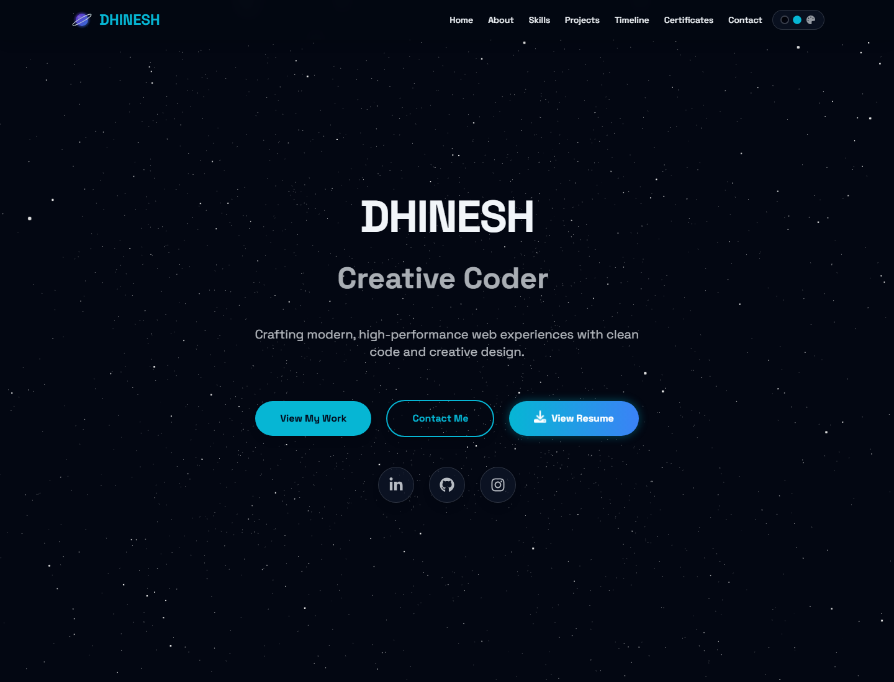
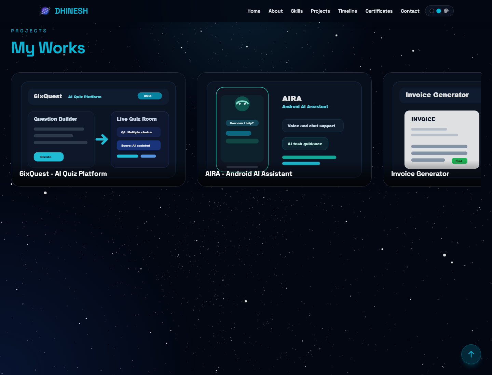
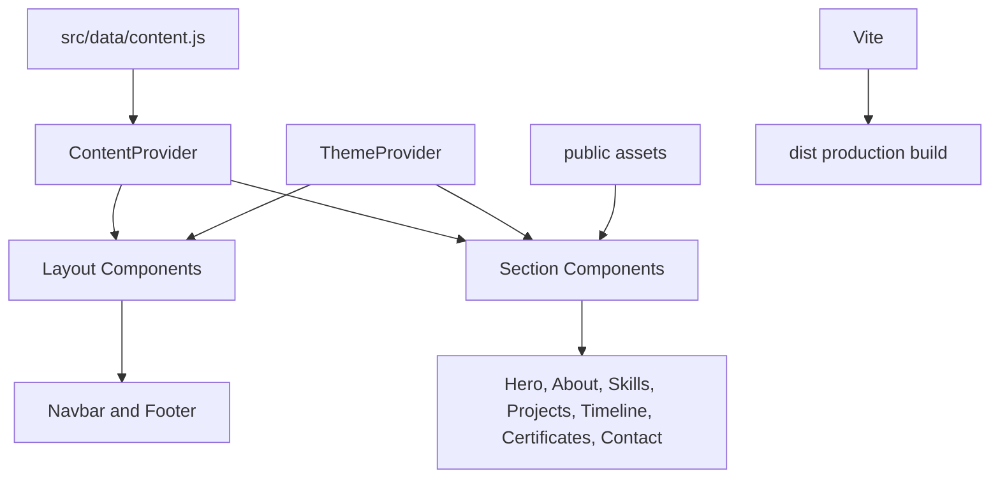

# DHINESH Portfolio

A modern personal portfolio for DHINESH, built with React, Vite, Tailwind CSS, and a Vercel serverless chatbot powered by Groq. It presents profile details, skills, featured projects, achievements, certificates, contact options, and a grounded portfolio assistant in a polished single-page experience.

## Live Deployment

[https://dhinesh-alpha.vercel.app/](https://dhinesh-alpha.vercel.app/)

## Screenshots





## Features

- Premium light-theme hero section with recruiter-focused positioning.
- Responsive navigation with active section highlighting and mobile menu.
- Centralized content management through one data file.
- Featured project cards with GitHub, live demo, and Play Store links.
- Icon-based skills, achievements, certificates, and contact sections.
- Portfolio-only chatbot using Groq through a Vercel Function.
- Chatbot retrieval scans source portfolio content and refuses unrelated questions.
- Contact form wired through Formspree.
- Optimized image assets for profile, timeline, and certificates.
- Production-ready Vite build configured for Vercel deployment.

## Tech Stack

- React 19
- Vite 7
- Tailwind CSS
- JavaScript
- GSAP and `@gsap/react`
- Three.js, `@react-three/fiber`, and `@react-three/drei`
- Framer Motion
- React Icons
- React Scroll
- Formspree React package
- Vercel Functions
- Groq Chat Completions API
- Sharp for image optimization

## Architecture Overview

The app is a data-driven single-page React portfolio. Most editable site content lives in `src/data/content.js`, then flows through `ContentProvider` so section components can render the current portfolio data without duplicating copy or links.



### Project Structure

```text
.
|-- api/
|   `-- chat.js
|-- public/
|   |-- screenshots/
|   |-- optimized/
|   |-- certificates/
|   `-- *.svg
|-- scripts/
|   `-- optimize-images.mjs
|-- src/
|   |-- components/
|   |   |-- common/
|   |   |-- layout/
|   |   `-- sections/
|   |-- context/
|   |-- data/
|   |-- hooks/
|   |-- utils/
|   |-- App.jsx
|   |-- index.css
|   `-- main.jsx
|-- index.html
|-- package.json
|-- tailwind.config.js
|-- vite.config.js
`-- vercel.json
```

## Setup Instructions

### Prerequisites

- Node.js `^20.19.0` or `>=22.12.0`
- npm

### Install Dependencies

```bash
npm install
```

### Run Locally

```bash
npm run dev
```

The local app will run at:

```text
http://127.0.0.1:5173/
```

For the chatbot API locally, use Vercel Dev so `/api/chat` runs as a serverless function:

```bash
npm install -g vercel
vercel dev
```

### Build for Production

```bash
npm run build
```

The production output is generated in `dist/`.

### Preview Production Build

```bash
npm run preview
```

### Lint

```bash
npm run lint
```

### Optimize Images

```bash
npm run optimize:images
```

## Deployment

This project is configured for Vercel.

- Framework preset: Vite
- Build command: `npm run build`
- Output directory: `dist`
- Live URL: [https://dhinesh-alpha.vercel.app/](https://dhinesh-alpha.vercel.app/)

### Required Environment Variables

Set these in Vercel Project Settings -> Environment Variables:

```text
GROQ_API_KEY=your_groq_api_key_here
GROQ_MODEL=llama-3.3-70b-versatile
```

`GROQ_MODEL` is optional. The app defaults to `llama-3.3-70b-versatile` if it is not set.

## Updating Portfolio Content

- Update profile, social links, and project data in `src/data/content.js`.
- Add static images or SVG assets inside `public/`.
- Add screenshots for documentation inside `public/screenshots/`.
- Run `npm run build` before deploying to confirm the production bundle works.
